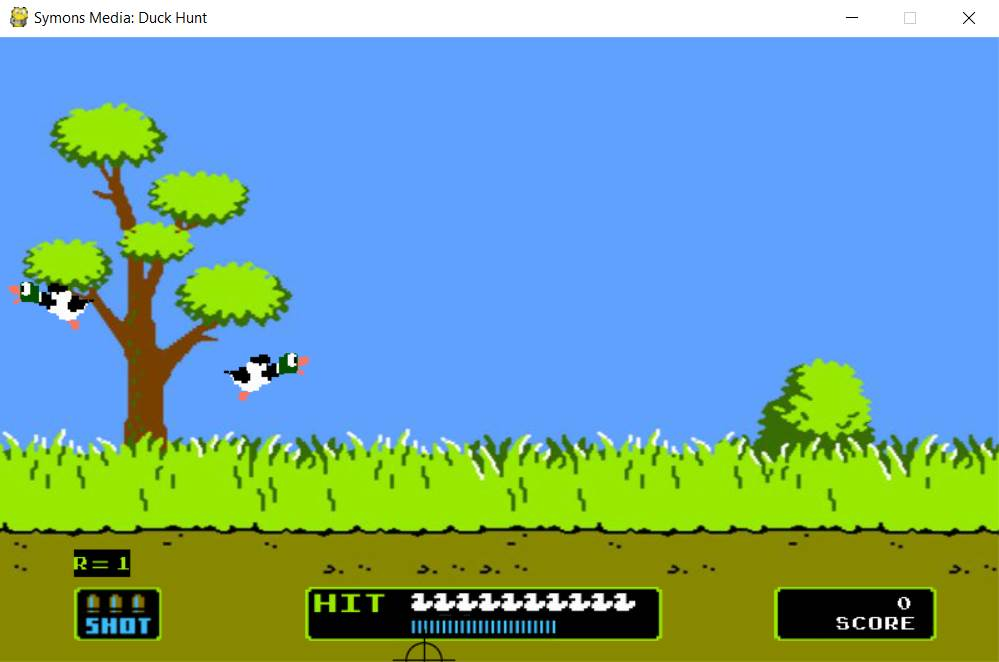

# Final Presentation

## Team Members

| Name          | Picture                            | Duties                                                           |
| ------------- | ---------------------------------- | ---------------------------------------------------------------- |
| Suhas Bacchu  |    | Implement Pygaze Eyetracking                                     |
| Alex Jirovsky |  | Change the existing code to make the game work with eye tracking |

## UI Sketch

### Game

### Main Function

- ~~Implement Eye tracking gameplay mode~~
- Implement Webcam AI Nerf Gun Mode
- Implement Toggle for ~~eye tracking~~ webcam vs regular game play

## "Moving Forward"

- Implement PyGaze and for eye tracking
- Create end game option

## Current Progress

- ~~We started working on implementation of PyGaze~~
- Implemented AI to detect Gun direction
- Implemented toggle
- Implemented End Game Option
- Modifed the code to Python 3 from Python 2
